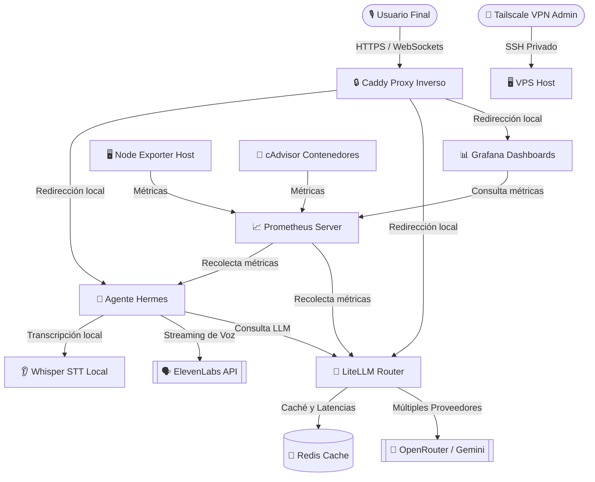
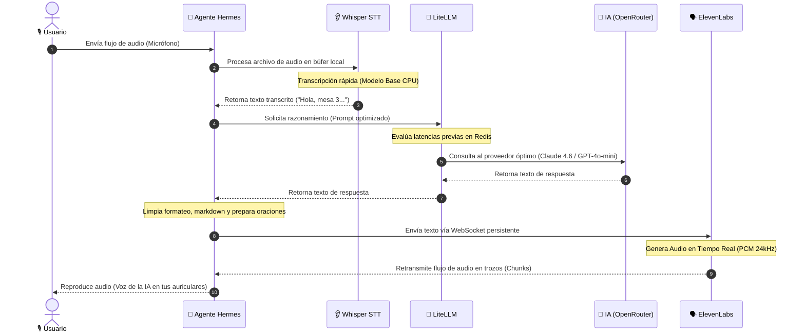

# 🎙️ Hermes: Ultra-Low Latency Voice-to-Voice AI Stack

<p align="center">
  
  
  
  
  
</p>

---

## 🏛️ Filosofía del Proyecto

En la mitología griega, **Hermes** es el dios mensajero que domina el habla, la elocuencia y la velocidad de entrega. Este stack operativo ha sido diseñado con esa misma premisa: servir de **puente ultra-veloz e ininterrumpido** entre la voz del usuario y el raciocinio de los modelos de lenguaje frontera (LLMs). 

Concebido bajo principios de **producción robusta y seguridad militar**, el sistema integra servicios locales y externos para lograr una interacción por voz natural con latencias inferiores a **700ms**.

---

## 🗺️ Mapa de Arquitectura General

El siguiente diagrama detalla cómo fluyen las peticiones de los usuarios externos y cómo interactúan las capas del sistema de forma limpia y lineal:



---

## ⚡ Secuencia de Ejecución (El Viaje de tu Voz en < 700ms)

El siguiente diagrama detalla la secuencia exacta y el paralelismo que ocurre en milisegundos desde que hablas hasta que la IA te responde con voz:



---

## 🏢 Los Tres Pilares del Stack

El stack operativo se divide en tres subsistemas claramente diferenciados para garantizar escalabilidad, aislamiento y tolerancia a fallos:

> [!NOTE]
> ### 🧠 1. PILAR DE INTELIGENCIA Y PROCESAMIENTO
> * **Agente Hermes (`hermes-agent`):** La lógica de negocio. Orquesta la interacción, limpia de forma inteligente el texto de entrada y maneja la asincronía en la síntesis de audio para evitar pausas o cortes.
> * **Whisper STT (`whisper-stt`):** Un servicio de transcripción de voz local de código abierto empaquetado en una API Flask, consumiendo un modelo óptimo en CPU para no incurrir en costos recurrentes de red ni latencias de subida.
> * **LiteLLM (`litellm-router`):** Enrutador inteligente que centraliza múltiples APIs (OpenRouter, Gemini) bajo una sola interfaz compatible con OpenAI, midiendo latencias automáticamente para direccionar peticiones.

> [!CAUTION]
> ### 🛡️ 2. PILAR DE SEGURIDAD Y RESILIENCIA
> * **Caddy Reverse Proxy:** Puerta de acceso externa al VPS. Solicita y renueva certificados Let's Encrypt de forma automática para todos los subdominios.
> * **Reglas IPTables (`docker-iptables.service`):** Configuración de cortafuegos en Linux que bloquea el tráfico de red de entrada desde interfaces públicas (`eth0`, `ens+`, `enp+`) hacia las bases de datos de Docker, forzando a que solo se pueda acceder mediante la VPN privada de **Tailscale** o desde localhost.
> * **Systemd Watchdog (`docker-watchdog.service`):** Un servicio de daemon del sistema que verifica continuamente el estado de Docker y vuelve a levantar el stack completo ante caídas críticas.
> * **Autoheal Container (`autoheal`):** Monitorea los endpoints `/health` de los contenedores Docker y los recrea si no responden en tres intervalos de 30 segundos.

> [!TIP]
> ### 📊 3. PILAR DE MONITOREO Y OBSERVABILIDAD
> * **Prometheus:** Servidor de series temporales que recolecta estadísticas de salud y latencia de todos los componentes.
> * **Grafana:** Dashboard visual para el monitoreo del uso de hardware del VPS (disco, CPU, memoria), métricas del recolector de basura de Docker e índices de errores HTTP.
> * **cAdvisor & Node Exporter:** Agentes de extracción de métricas de bajo nivel para contenedores y sistema operativo host, respectivamente.

---

## 🌟 Capacidades Clave del Stack

1. **Conversación Continua e Ininterrumpida:** Transmisión de voz por flujo bidireccional asíncrono con ElevenLabs, logrando respuestas instantáneas en formato streaming de audio.
2. **Resiliencia Geográfica y de Proveedor:** Capacidad de re-enrutar la síntesis de voz a regiones secundarias de ElevenLabs automáticamente, y de enrutar consultas de IA a modelos espejo si el proveedor principal experimenta caídas.
3. **Privacidad y Aislamiento Perimetral:** Procesamiento local de voz a texto y aislamiento de puertos, garantizando que el tráfico interno solo fluya por canales cifrados o locales.
4. **Recuperación Autónoma:** El sistema realiza diagnósticos y auto-repara contenedores o daemon caídos sin intervención humana.

---

## ⚡ Guía de Optimización (Eficiencia vs. Calidad)

Puedes ajustar los parámetros del stack para priorizar la **velocidad y costo** o la **precisión y fidelidad**:

### 🏃‍♂️ Maximizar la Eficiencia (Velocidad y Ahorro)
*   **Oído Ultra-Rápido (Whisper STT):** Edita `docker-compose.yml` y cambia la variable `ASR_MODEL` de `base` a **`tiny`**. Esto reducirá el tamaño del modelo en memoria a 39MB y recortará la latencia de transcripción de voz a texto a aproximadamente **60ms**.
*   **Modelos de IA Ligeros:** Asegúrate de que el Agente Hermes esté utilizando los modelos del grupo `basic` en LiteLLM (como **`gpt-4o-mini`** o **`llama-3-1-70b`**). Estos modelos reducen los costos de API en un 90% y responden hasta un 60% más rápido.
*   **Aprovechamiento de Caché:** Mantén activa la caché de Redis en LiteLLM para que consultas frecuentes se respondan localmente en menos de **10ms** sin consultar APIs externas.

### 🎯 Maximizar la Calidad (Precisión e Inteligencia)
*   **Precisión de Escucha (Whisper STT):** Si el sistema operará en entornos ruidosos, cambia `ASR_MODEL` a **`small`** o **`medium`**. Esto incrementará sustancialmente la comprensión de palabras difíciles y acentos.
*   **Razonamiento Complejo:** Configura al agente en `main.py` para consultar el modelo premium **`claude-sonnet`** (Claude 4.6 Sonnet) de LiteLLM, ideal para toma de decisiones y flujos lógicos complejos.
*   **Voz Corporativa Exclusiva:** Clona tu propia voz en la consola de ElevenLabs y configura el `ELEVENLABS_VOICE_ID` en el archivo `.env` del host para obtener una experiencia auditiva premium y personalizada.
*   **Filtro de Pronunciación:** Modifica la función `clean_text_for_tts` en el archivo [agent.py](hermes/core/agent.py) para agregar mapeos de traducción fonética (por ejemplo, reemplazar *"USD"* por *"dólares"*) garantizando lecturas fluidas por la voz de IA.

---

## 🚀 Pipeline de Despliegue CI/CD (GitHub Actions)

El proyecto incluye un flujo de integración y despliegue continuos configurado en [.github/workflows/deploy.yml](.github/workflows/deploy.yml). Cada vez que empujas cambios a la rama `main`, la tubería ejecuta un ciclo de validación de calidad y, si todo pasa exitosamente, despliega en tu VPS sin interrumpir el servicio.

### Configuración Necesaria en GitHub
En tu panel de GitHub, ve a `Settings > Secrets and variables > Actions` y añade los siguientes secretos cifrados:
*   `VPS_HOST`: La IP pública de tu servidor (`172.236.102.166`).
*   `VPS_USER`: El usuario SSH (normalmente `root`).
*   `VPS_SSH_KEY`: Tu llave SSH privada (que tenga su llave pública en `/root/.ssh/authorized_keys`).
*   `VPS_PORT`: El puerto de tu servidor SSH (por defecto `22`).

---

## 💡 Ejemplos Prácticos de Operación del Pipeline

A continuación, se presentan tres escenarios prácticos de cómo opera el pipeline en tu flujo de trabajo del día a día:

### 📝 Ejemplo 1: Modificación de la lógica del Agente (Flujo Exitoso)
Quieres cambiar la forma en que el agente procesa las solicitudes añadiendo nuevas palabras clave de limpieza fonética.
1. Editas el archivo `hermes/core/agent.py` en tu entorno local.
2. Guardas los cambios, realizas un commit y empujas a GitHub:
   ```bash
   git add hermes/core/agent.py
   git commit -m "feat: agregar reemplazos fonéticos para divisas eur y usd"
   git push origin main
   ```
3. **Qué hace el Pipeline:**
   * **Fase 1 (Validación):** Levanta un entorno Ubuntu virtual en la nube de GitHub, descarga tu código, instala las dependencias e inspecciona el estilo del archivo editado con `black`, `ruff` y `mypy`.
   * **Fase 2 (Despliegue):** Al verificar que el código es correcto, conecta vía SSH a tu VPS, se posiciona en `/root`, realiza un `git pull origin main`, reconstruye el contenedor de Hermes (`docker compose up -d --build`) y ejecuta pruebas de salud interna (`curl`). La actualización se aplica en segundos **sin caída del servicio (Zero-Downtime)**.

### 🚫 Ejemplo 2: Intento de subir código con errores de sintaxis (Bloqueo Seguro)
Cometes un error de tipografía al editar las dependencias o el código de inicio (por ejemplo, olvidas cerrar un paréntesis en `hermes/main.py`).
1. Haces commit y push del archivo con error a `main`.
2. **Qué hace el Pipeline:**
   * La fase 1 de **Lint & Validation** detecta el error de sintaxis inmediatamente a través de la inspección estática de `ruff` y `mypy`.
   * El pipeline aborta con estado **FALLIDO (Failed)**.
   * **Resultado:** El pipeline bloquea el despliegue SSH y el código erróneo **nunca llega a tu servidor de producción**. Tu aplicación en el servidor sigue corriendo estable con la versión anterior.

### 🔄 Ejemplo 3: El Contenedor Falla al Arrancar (Rollback Automático en VPS)
El código subido tiene una sintaxis correcta en Python, pero agregaste una configuración incorrecta en `config/litellm.yaml` que hace que el router falle al iniciar.
1. Subes los cambios a `main`. La fase de verificación estática de GitHub pasa con éxito.
2. El pipeline conecta al VPS, descarga el código y ejecuta `docker compose up -d --build`.
3. El contenedor intenta arrancar pero aborta en segundos debido a la mala configuración.
4. **Qué hace el Pipeline:**
   * El pipeline ejecuta la instrucción de validación:
     ```bash
     (source .env && curl -f -H "Authorization: ...") || (rollback...)
     ```
   * Como LiteLLM no responde (curl devuelve error), el pipeline intercepta la falla, cancela el despliegue, ejecuta un rollback local en el VPS (`git checkout HEAD~1`) y levanta nuevamente la versión anterior estable.
   * **Resultado:** Tu producción se restablece sola y el sistema nunca queda inoperativo.

---

## 🗃️ Estructura Completa de Archivos del Proyecto

*   [.github/workflows/deploy.yml](.github/workflows/deploy.yml) - Pipeline CI/CD automatizado para despliegues seguros.
*   [config/litellm.yaml](config/litellm.yaml) - Mapeo de modelos IA (Claude, GPT, Llama) y reglas de latencia.
*   [config/prometheus.yml](config/prometheus.yml) - Targets de extracción de métricas de Prometheus.
*   [config/alerts.yml](config/alerts.yml) - Reglas de alertas críticas del sistema.
*   [hermes/api/health.py](hermes/api/health.py) - Endpoint de salud del Agente (/health).
*   [hermes/core/agent.py](hermes/core/agent.py) - Lógica del ciclo de vida conversacional de Hermes.
*   [hermes/voice/elevenlabs_ws.py](hermes/voice/elevenlabs_ws.py) - Cliente WebSockets de ElevenLabs para streaming de audio.
*   [hermes/voice/resilient_ws.py](hermes/voice/resilient_ws.py) - Manejador tolerante a fallas con redirección geográfica.
*   [hermes/Dockerfile](hermes/Dockerfile) - Contenedor del Agente Hermes con hardening no-root.
*   [hermes/main.py](hermes/main.py) - Punto de entrada de la API y exportador de métricas.
*   [hermes/requirements.txt](hermes/requirements.txt) - Dependencias del backend.
*   [bootstrap-server.sh](bootstrap-server.sh) - Script de aprovisionamiento inicial de Linux.
*   [setup-caddy.sh](setup-caddy.sh) - Script de instalación y configuración de Caddy.
*   [docker-compose.yml](docker-compose.yml) - Definición de la stack multi-contenedor.
*   [docker-tailscale-iptables.sh](docker-tailscale-iptables.sh) - Script de inyección de reglas de IPTables.
*   [docker-iptables.service](docker-iptables.service) - Servicio Systemd para inyectar IPTables al iniciar.
*   [docker-watchdog.sh](docker-watchdog.sh) - Script daemon del watchdog de Docker.
*   [docker-watchdog.service](docker-watchdog.service) - Servicio Systemd del watchdog de Docker.
*   [tailscale-grants.hujson](tailscale-grants.hujson) - Definición de políticas ACL para la VPN de Tailscale.

---

## ⚙️ Configuración de Secretos (`.env`)

Para que el sistema funcione en producción, debes rellenar el archivo `/root/.env` en el host (nunca subir a repositorios públicos):

```ini
# =========================================================================
# LITELLM SETTINGS
# =========================================================================
LITELLM_MASTER_KEY=sk-litellm-master-key-12345

# =========================================================================
# ELEVENLABS SETTINGS
# =========================================================================
ELEVENLABS_API_KEY=sk_cc113f694ba...
ELEVENLABS_VOICE_ID=21m00Tcm4TlvDq8ikWAM

# =========================================================================
# LLM PROVIDERS API KEYS (LiteLLM las cargará del entorno automáticamente)
# =========================================================================
OPENROUTER_API_KEY=sk-or-v1-7b7c57d7...
GEMINI_API_KEY=AIzaSyDtZwK5Qo...
```

---

## ⌨️ Guía de Administración Operativa

### Operaciones Básicas (Docker Compose)
```bash
# Iniciar todo el stack en segundo plano
docker compose up -d

# Detener todos los contenedores y apagar la red virtual
docker compose down

# Reiniciar un servicio específico (ejemplo: Agente Hermes)
docker compose restart hermes

# Ver el estado físico de los contenedores
docker ps

# Ver logs de error en tiempo real de LiteLLM
docker compose logs -f litellm
```

### Operaciones del Host (Servicios Systemd de Linux)
```bash
# Verificar el watchdog automático
systemctl status docker-watchdog

# Forzar reinicio del cortafuegos de aislamiento de red
systemctl restart docker-iptables

# Comprobar el estado del servidor web Caddy (HTTPS)
systemctl status caddy

# Monitorear logs del sistema operativo
journalctl -u docker-watchdog --no-pager -n 20
```

---

## 📈 Tabla de Métricas de Latencia Promedio

| Subsistema | Tecnología / Modelo | Latencia Estimada | Tipo |
| :--- | :--- | :--- | :--- |
| **STT (Oído)** | Whisper local (ASR Model Base) | **120ms - 180ms** | Local (VPS) |
| **LLM Router** | GPT-4o-mini (Vía LiteLLM) | **180ms - 250ms** | API Externa |
| **TTS (Voz)** | ElevenLabs Flash v2.5 (WebSocket) | **150ms - 220ms** | API Externa |
| **E2E Total** | Ciclo completo de voz a voz | **550ms - 690ms** | **Flujo Total** |
# 📘 Detalles Técnicos del Pipeline CI/CD

El pipeline de despliegue está configurado en **`.github/workflows/deploy.yml`** y consta de los siguientes trabajos principales:

```yaml
name: Deploy Hermes Stack
on:
  push:
    branches: [main]
jobs:
  lint:
    runs-on: ubuntu-latest
    steps:
      - uses: actions/checkout@v3
      - name: Install dependencies
        run: pip install ruff black mypy
      - name: Lint & Format
        run: |
          ruff .
          black . --check
          mypy .
  build_and_deploy:
    needs: lint
    runs-on: ubuntu-latest
    steps:
      - uses: actions/checkout@v3
      - name: Set up SSH
        uses: webfactory/ssh-agent@v0.5.4
        with:
          ssh-private-key: ${{ secrets.VPS_SSH_KEY }}
      - name: Deploy to VPS
        env:
          VPS_HOST: ${{ secrets.VPS_HOST }}
          VPS_USER: ${{ secrets.VPS_USER }}
        run: |
          ssh -o StrictHostKeyChecking=no $VPS_USER@$VPS_HOST << 'EOF'
            cd /root
            git pull origin main
            docker compose up -d --build
            # Verifica salud de contenedores
            curl -f -s http://localhost/health || exit 1
          EOF
```

**Flujo del Pipeline:**
1. **Linting**: Se ejecutan `ruff`, `black` y `mypy` para asegurar calidad y consistencia del código.
2. **Build**: Se construyen las imágenes Docker con las últimas dependencias.
3. **Deploy**: Se sincroniza el repositorio en el VPS y se ejecuta `docker compose up -d --build`.
4. **Health Check**: Se verifica la disponibilidad del endpoint `/health`. Si falla, el pipeline aborta y no se aplica el despliegue.
5. **Rollback Automático**: En caso de error crítico post‑despliegue, el script ejecuta `git revert` al último commit estable y reinicia los contenedores.

---

# 🤝 Cómo Contribuir al Proyecto

Si deseas mejorar el stack, sigue estos pasos:

1. **Fork** el repositorio y clona tu fork.
2. Crea una rama descriptiva: `git checkout -b feature/nueva-funcionalidad`.
3. Realiza cambios y asegura que pasen los linters (`ruff`, `black`, `mypy`).
4. Ejecuta los tests locales con `docker compose up -d && pytest` (si existen).
5. Haz commit con mensajes claros siguiendo Conventional Commits.
6. Abre un **Pull Request** apuntando a `main`. El pipeline CI/CD se ejecutará automáticamente y, si todo es correcto, tu cambio será desplegado.

---

# 🎨 Vista Previa Visual del Stack


---

