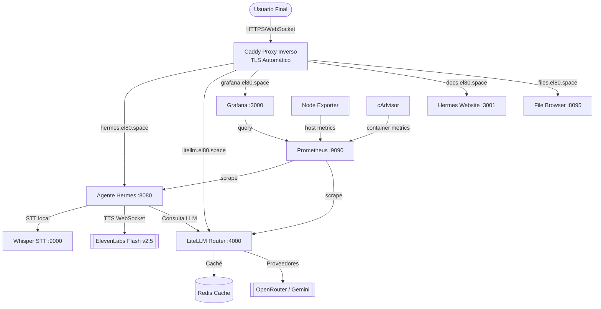
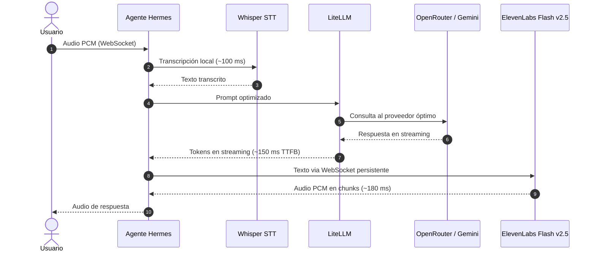
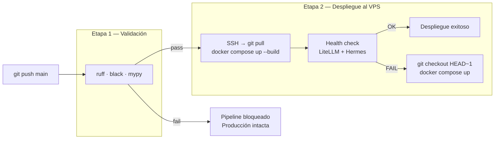

# Hermes Stack — Plataforma IA Conversacional Autohospedada

<p align="center">
  
  
  
  
  
</p>

---

## Filosofía del Proyecto

En la mitología griega, **Hermes** es el dios mensajero que domina el habla, la elocuencia y la velocidad. Este stack ha sido diseñado con esa premisa: ser un **puente ultra-veloz** entre la voz del usuario y los modelos de lenguaje frontera, con latencia end-to-end inferior a **500 ms**.

Construido sobre principios de **soberanía de datos**, **auto-curación** y **zero-downtime deployment** desde un único VPS.

---

## Mapa de Arquitectura General



---

## Pipeline de Voz End-to-End (< 500 ms)



---

## Los Tres Pilares del Stack

> [!NOTE]
> ### 1. Inteligencia y Procesamiento
> - **Hermes Agent** — Orquesta el ciclo completo: STT → LLM → TTS. Expone API HTTP/WS en `:8080` y métricas Prometheus en `/metrics`.
> - **Whisper STT** — Transcripción local (modelo `base`, ~100 ms en CPU). Sin costos de API ni envío de audio a terceros.
> - **LiteLLM Router** — Proxy OpenAI-compatible. Enruta a OpenRouter o Gemini según latencia medida. Caché semántico vía Redis.

> [!CAUTION]
> ### 2. Seguridad y Resiliencia
> - **Caddy** — Único punto de entrada público. Certificados Let's Encrypt automáticos para todos los subdominios.
> - **Hardening de contenedores** — `no-new-privileges`, `cap_drop: ALL`, puertos solo en `127.0.0.1`.
> - **Autoheal** — Reinicia contenedores con healthcheck fallido cada 30 s.
> - **docker-watchdog** — Servicio systemd que verifica el daemon Docker y los contenedores críticos cada 60 s.

> [!TIP]
> ### 3. Observabilidad y Gestión
> - **Prometheus + Grafana** — Métricas de host (CPU, RAM, disco) y de contenedores en tiempo real.
> - **cAdvisor + Node Exporter** — Agentes de extracción de métricas de bajo nivel.
> - **File Browser** — Gestor de archivos web en `files.el80.space` para administración sin SSH.

---

## Servicios y Subdominios

| Servicio | Imagen | Puerto interno | Subdominio público |
| :--- | :--- | :---: | :--- |
| **hermes-agent** | build local | `:8080` | `hermes.el80.space` |
| **litellm-router** | `ghcr.io/berriai/litellm` | `:4000` | `litellm.el80.space` |
| **grafana** | `grafana/grafana:11.0.0` | `:3000` | `grafana.el80.space` |
| **hermes-website** | build local (React/Vite) | `:3001` | `docs.el80.space` |
| **filebrowser** | `filebrowser/filebrowser` | `:8095` | `files.el80.space` |
| **whisper-stt** | `onerahmet/openai-whisper-asr-webservice` | `:9000` | — interno |
| **redis-cache** | `redis:7-alpine` | — | — interno |
| **prometheus** | `prom/prometheus:v2.52.0` | `:9090` | — interno |
| **cadvisor** | `gcr.io/cadvisor/cadvisor` | — | — interno |
| **node-exporter** | `prom/node-exporter:v1.8.1` | — | — interno |

---

## Pipeline CI/CD (GitHub Actions)

Cada push a `main` dispara dos etapas:



### Secretos requeridos en GitHub

Ve a `Settings > Secrets and variables > Actions` y configura:

| Secret | Valor |
| :--- | :--- |
| `VPS_HOST` | IP pública del servidor |
| `VPS_USER` | Usuario SSH (`root`) |
| `VPS_SSH_KEY` | Clave privada SSH |
| `VPS_PORT` | Puerto SSH (default `22`) |

### Escenarios de operación

**Flujo exitoso — modificación del agente:**
```bash
git add hermes/core/agent.py
git commit -m "feat: agregar reemplazos fonéticos"
git push origin main
# → Lint pasa → deploy SSH → health check OK → producción actualizada
```

**Bloqueo por lint — error de sintaxis:**
```bash
# Hermes/main.py con error de sintaxis
git push origin main
# → ruff detecta error → pipeline FALLIDO → producción intacta
```

**Rollback automático — contenedor falla al arrancar:**
```bash
# Config incorrecta en litellm.yaml
git push origin main
# → Lint pasa → deploy → LiteLLM no responde → rollback a HEAD~1
```

---

## Configuración de Secretos (`.env`)

Crea `/root/.env` en el VPS (nunca subir al repositorio):

```ini
# LiteLLM
LITELLM_MASTER_KEY=sk-litellm-tu-clave-aqui

# ElevenLabs
ELEVENLABS_API_KEY=sk_...
ELEVENLABS_VOICE_ID=21m00Tcm4TlvDq8ikWAM

# Proveedores LLM
OPENROUTER_API_KEY=sk-or-v1-...
GEMINI_API_KEY=AIzaSy...
```

---

## Optimización: Velocidad vs Calidad

### Maximizar velocidad y ahorro
- **Whisper:** cambia `ASR_MODEL` de `base` a `tiny` (~60 ms, 39 MB RAM).
- **LLM:** usa modelos `basic` en LiteLLM (`gpt-4o-mini`, `llama-3.1-70b`).
- **Caché:** mantén Redis activo — consultas repetidas responden en < 10 ms.

### Maximizar precisión y calidad
- **Whisper:** cambia a `small` o `medium` para entornos ruidosos o acentos.
- **LLM:** configura `claude-sonnet-4-6` en LiteLLM para razonamiento complejo.
- **Voz:** clona tu voz en ElevenLabs y actualiza `ELEVENLABS_VOICE_ID` en `.env`.

---

## Tabla de Latencias

| Subsistema | Tecnología | Latencia estimada | Tipo |
| :--- | :--- | :---: | :--- |
| **STT** | Whisper `base` en CPU | 80–120 ms | Local |
| **Routing** | Hermes Agent | 3–8 ms | Local |
| **LLM (TTFB)** | OpenRouter / Gemini | 100–180 ms | API externa |
| **TTS** | ElevenLabs Flash v2.5 WS | 150–220 ms | API externa |
| **Red/Buffer** | VPS → cliente | 10–30 ms | Red |
| **E2E Total** | Ciclo completo voz-a-voz | **343–558 ms** | — |

---

## Estructura del Repositorio

```
hermes-stack/
├── .github/workflows/deploy.yml  # Pipeline CI/CD
├── config/
│   ├── litellm.yaml              # Modelos, fallbacks y caché Redis
│   ├── prometheus.yml            # Targets de scrape
│   └── alerts.yml                # Reglas de alerta
├── hermes/
│   ├── Dockerfile                # Imagen del agente (hardening non-root)
│   ├── main.py                   # Punto de entrada + exportador Prometheus
│   ├── requirements.txt
│   ├── api/health.py             # Endpoint /health
│   ├── core/agent.py             # Ciclo conversacional principal
│   └── voice/
│       ├── elevenlabs_ws.py      # Cliente WebSocket ElevenLabs
│       └── resilient_ws.py       # WS tolerante a fallos (failover geográfico)
├── website/
│   ├── Dockerfile                # SPA React/Vite + Express (docs.el80.space)
│   ├── src/                      # Componentes React + Tailwind
│   └── server.js                 # Backend Express con /api/tree y /health
├── hermes_bp/
│   ├── main.tex                  # Blueprint técnico XeLaTeX (24 pp)
│   └── s{1..4}_*.tex             # Secciones: arquitectura, servicios, CI/CD, observabilidad
├── docker-compose.yml            # Definición de los 10 servicios
├── setup-caddy.sh                # Instalación y configuración de Caddy
├── docker-watchdog.sh            # Daemon watchdog de contenedores
└── docker-watchdog.service       # Unidad systemd del watchdog
```

---

## Administración Operativa

```bash
# Estado del stack
docker compose ps
docker stats --no-stream

# Logs en tiempo real
docker compose logs -f hermes
docker compose logs -f litellm --tail=50

# Health check completo
source /root/.env
curl -f -H "Authorization: Bearer $LITELLM_MASTER_KEY" http://127.0.0.1:4000/health
curl -f http://127.0.0.1:8080/health

# Operaciones de servicio
docker compose restart hermes
docker compose up -d --build website

# Servicios systemd del host
systemctl status caddy
systemctl status docker-watchdog
journalctl -u docker-watchdog -n 30
```

---

## Contribuir

1. Fork del repositorio y crea una rama: `git checkout -b feat/mi-mejora`
2. Aplica tus cambios y verifica que pasen `ruff`, `black` y `mypy`.
3. Commit con mensajes en formato [Conventional Commits](https://www.conventionalcommits.org/).
4. Abre un **Pull Request** a `main` — el pipeline CI/CD se ejecuta automáticamente.
