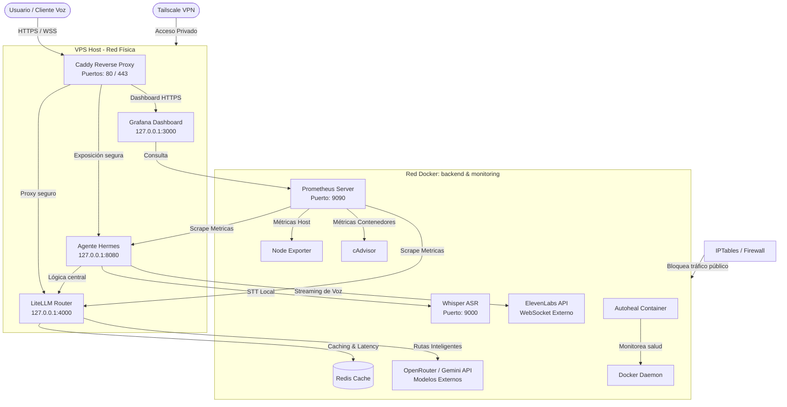

# Stack Operativo Hermes: Arquitectura de Ultra-Baja Latencia (Voz a Voz)

Este repositorio contiene la arquitectura completa, segura y automatizada para desplegar el **Agente de Inteligencia Artificial Hermes** con canal de comunicación por voz de ultra-baja latencia (menor a 700ms).

El sistema está diseñado bajo principios de **defensa en profundidad**, alta disponibilidad, monitoreo en tiempo real y exposición segura a través de HTTPS automático.

---

## 🗺️ Mapa de la Arquitectura del Sistema

El flujo de información y conexión entre los componentes del sistema se organiza de la siguiente manera:



---

## 📦 Componentes del Sistema

El stack está compuesto por 9 servicios integrados en Docker y 3 servicios nativos en el sistema operativo del VPS:

### 1. El Cerebro: Agente Hermes (`hermes-agent`)
* **Qué hace:** Es la aplicación central escrita en Python. Maneja la lógica conversacional, mantiene el historial de diálogos de los usuarios y pre-procesa el texto (limpiando markdown y formateando números) para que sea óptimo para la síntesis de voz.
* **Canal de Voz:** Se conecta a **ElevenLabs Flash v2.5** mediante WebSockets asíncronos y resilientes con retroceso exponencial (en caso de desconexión, reintenta y redirige a la región de respaldo `api.us.elevenlabs.io` automáticamente).
* **Seguridad:** Corre con un usuario de bajos privilegios (`hermes:hermesgrp`) y el sistema de archivos del contenedor está bloqueado como **solo lectura** (`read_only`).

### 2. Enrutador LLM Inteligente: LiteLLM (`litellm-router`)
* **Qué hace:** Actúa como un proxy unificado para todos los modelos de Inteligencia Artificial.
* **Modelo Premium Principal:** Enruta las solicitudes a **Claude 4.6 Sonnet** y **GPT-4o** a través de OpenRouter.
* **Modelo Económico Rápido:** Usa **GPT-4o-mini** y **Llama 3.1 70B**.
* **Estrategia de Enrutamiento:** Calcula la latencia de respuesta de los proveedores en tiempo real y dirige las solicitudes al modelo más rápido y saludable de forma automática. Si un proveedor falla, redirige la solicitud inmediatamente (Fallback).

### 3. Base de Datos en Memoria: Redis (`redis-cache`)
* **Qué hace:** Almacena en caché las respuestas de los modelos de LiteLLM para evitar llamadas redundantes de API y guarda el historial de latencias para la toma de decisiones del router.

### 4. Transcripción Local: Whisper STT (`whisper-stt`)
* **Qué hace:** Convierte la voz del usuario a texto de forma totalmente local en el VPS usando el modelo `base` optimizado para CPU, eliminando costos y latencias de red externos.

### 5. Monitoreo en Tiempo Real (`prometheus` & `grafana`)
* **Prometheus:** Recolecta métricas de rendimiento del Agente Hermes, LiteLLM, uso de hardware del VPS (`node-exporter`) y consumo de recursos de los contenedores (`cadvisor`) de forma continua.
* **Grafana:** Visualiza estas métricas en dashboards dinámicos. Puedes acceder a tus métricas en tiempo real bajo HTTPS seguro.

### 6. Auto-recuperación y Vigilancia (`autoheal` & `docker-watchdog`)
* **Autoheal (Contenedor):** Monitorea los contenedores de Docker. Si detecta que `litellm` o `hermes` reportan estado "unhealthy" (no saludable), los reinicia de manera inmediata.
* **Watchdog del Host (Systemd):** Script bash corriendo como servicio nativo de Linux. Monitorea que el servicio de Docker mismo esté respondiendo. Si Docker se cae, lo reinicia y levanta todo el stack de contenedores desde `/root`.

### 7. Seguridad de Red (`caddy`, `tailscale` & `iptables`)
* **Caddy:** Servidor web inverso en el Host. Escucha en los puertos públicos `80` y `443`, recibe las solicitudes dirigidas a `el80.space` y gestiona automáticamente los certificados SSL seguros con Let's Encrypt.
* **Tailscale:** Permite el acceso seguro y administrativo al servidor mediante una red privada cifrada.
* **IPTables (Firewall):** Bloquea todo el tráfico público entrante directo a los puertos de los contenedores Docker (como Redis, Whisper o Prometheus). Solo permite conexiones locales desde Caddy (`127.0.0.1`) o desde tu red privada de Tailscale.

---

## 🛠️ Gestión y Operación del Sistema

Todos los comandos deben ejecutarse desde la carpeta raíz del proyecto (`/root`).

### Comandos de Docker Compose
```bash
# Iniciar todo el sistema en segundo plano
docker compose up -d

# Detener todos los servicios
docker compose down

# Ver el estado de salud de los contenedores
docker ps

# Ver logs en tiempo real de un servicio específico (ej. hermes)
docker compose logs -f hermes

# Reiniciar un contenedor específico
docker compose restart litellm
```

### Comandos de Servicios del Sistema (Systemd)
```bash
# Verificar estado del Proxy Inverso Caddy
systemctl status caddy

# Verificar el Watchdog automático del servidor
systemctl status docker-watchdog

# Verificar el firewall de aislamiento de Docker
systemctl status docker-iptables

# Verificar conexión a la VPN de Tailscale
tailscale status
```

---

## 🔗 Endpoints del Sistema en Producción

Tus servicios están expuestos de forma pública y protegidos por SSL (HTTPS) bajo tu dominio:

* 🧠 **Agente Hermes (API del Agente):** `https://hermes.el80.space`
* 🔀 **LiteLLM Proxy (Router de LLMs):** `https://litellm.el80.space` *(Requiere Bearer Token)*
* 📊 **Métricas del Sistema (Grafana):** `https://grafana.el80.space`

### Pruebas de Salud y Funcionamiento (desde cualquier consola externa)

1. **Verificar que el Agente y todas sus conexiones (LiteLLM, ElevenLabs) están OK:**
   ```bash
   curl -s https://hermes.el80.space/health
   ```
   *Respuesta esperada:*
   `{"status": "healthy", "checks": {"litellm": true, "elevenlabs": true, "disk": true, "skills": true}}`

2. **Probar el procesamiento conversacional del Agente (Prueba de Latencia):**
   ```bash
   curl -X POST -H "Content-Type: application/json" \
        -d '{"text": "Hola, registra la mesa 4 con dos sodas"}' \
        https://hermes.el80.space/process
   ```
   *Respuesta esperada:*
   `{"text": "Entendido. He registrado dos sodas en la mesa 4.", "model_used": "gpt-4o-mini", "latency_ms": 685.4}`

---

## 🔐 Archivo de Configuración de Secretos (`.env`)

Las llaves del sistema se administran de manera centralizada en el archivo oculto `/root/.env`. **Este archivo nunca se sube a GitHub por seguridad**. Las variables clave son:

```ini
# Llave maestra para hablar con el enrutador LiteLLM
LITELLM_MASTER_KEY=sk-litellm-master-key-12345

# API Key de ElevenLabs para el canal de voz
ELEVENLABS_API_KEY=sk_cc113f694ba75...
ELEVENLABS_VOICE_ID=21m00Tcm4TlvDq8ikWAM

# Llaves de Proveedores de IA (utilizadas por LiteLLM)
OPENROUTER_API_KEY=sk-or-v1-7b7c57d71...
GEMINI_API_KEY=AIzaSyDtZwK5Qo...
```
