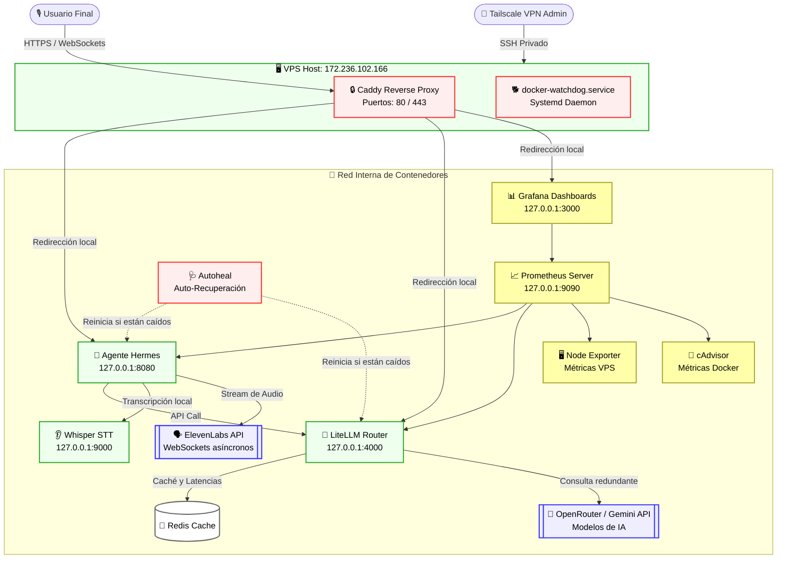
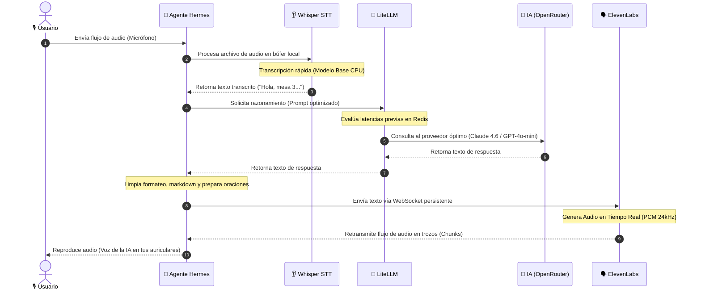

# 🎙️ Hermes: Ultra-Low Latency Voice-to-Voice AI Stack

<p align="center">
  
  
  
  
  
</p>

---

## 🏛️ Filosofía del Proyecto

En la mitología griega, **Hermes** es el dios mensajero que domina el habla, la elocuencia y la velocidad de entrega. Este stack operativo ha sido diseñado con esa misma premisa: servir de **puente ultra-veloz e ininterrumpido** entre la voz del usuario y el raciocinio de los modelos de lenguaje frontera (LLMs). 

Concebido bajo principios de **producción robusta y seguridad militar**, el sistema integra servicios locales y externos para lograr una interacción por voz natural con latencias inferiores a **700ms**.

---

## 🗺️ Mapa de Arquitectura General

El siguiente diagrama ilustra cómo fluyen las peticiones de los usuarios externos y cómo se aíslan los servicios internos de la máquina VPS:



---

## ⚡ Secuencia de Ejecución (El Viaje de tu Voz en < 700ms)

El siguiente diagrama detalla la secuencia exacta y el paralelismo que ocurre en milisegundos desde que hablas hasta que la IA te responde con voz:



---

## 🏢 Los Tres Pilares del Stack

El stack operativo se divide en tres subsistemas claramente diferenciados para garantizar escalabilidad, aislamiento y tolerancia a fallos:

> [!NOTE]
> ### 🧠 1. PILAR DE INTELIGENCIA Y PROCESAMIENTO
> * **Agente Hermes (`hermes-agent`):** La lógica de negocio. Orquesta la interacción, limpia de forma inteligente el texto de entrada y maneja la asincronía en la síntesis de audio para evitar pausas o cortes.
> * **Whisper STT (`whisper-stt`):** Un servicio de transcripción de voz local de código abierto empaquetado en una API Flask, consumiendo un modelo óptimo en CPU para no incurrir en costos recurrentes de red ni latencias de subida.
> * **LiteLLM (`litellm-router`):** Enrutador inteligente que centraliza múltiples APIs (OpenRouter, Gemini) bajo una sola interfaz compatible con OpenAI, midiendo latencias automáticamente para direccionar peticiones.

> [!CAUTION]
> ### 🛡️ 2. PILAR DE SEGURIDAD Y RESILIENCIA
> * **Caddy Reverse Proxy:** Puerta de acceso externa al VPS. Solicita y renueva certificados Let's Encrypt de forma automática para todos los subdominios.
> * **Reglas IPTables (`docker-iptables.service`):** Configuración de cortafuegos en Linux que bloquea el tráfico de red de entrada desde interfaces públicas (`eth0`, `ens+`, `enp+`) hacia las bases de datos de Docker, forzando a que solo se pueda acceder mediante la VPN privada de **Tailscale** o desde localhost.
> * **Systemd Watchdog (`docker-watchdog.service`):** Un servicio de daemon del sistema que verifica continuamente el estado de Docker y vuelve a levantar el stack completo ante caídas críticas.
> * **Autoheal Container (`autoheal`):** Monitorea los endpoints `/health` de los contenedores Docker y los recrea si no responden en tres intervalos de 30 segundos.

> [!TIP]
> ### 📊 3. PILAR DE MONITOREO Y OBSERVABILIDAD
> * **Prometheus:** Servidor de series temporales que recolecta estadísticas de salud y latencia de todos los componentes.
> * **Grafana:** Dashboard visual para el monitoreo del uso de hardware del VPS (disco, CPU, memoria), métricas del recolector de basura de Docker e índices de errores HTTP.
> * **cAdvisor & Node Exporter:** Agentes de extracción de métricas de bajo nivel para contenedores y sistema operativo host, respectivamente.

---

## 🗃️ Estructura Completa de Archivos del Proyecto

```
/root/
├── .github/
│   └── workflows/
│       └── deploy.yml               # Pipeline CI/CD automatizado para despliegues seguros
├── config/
│   ├── litellm.yaml                # Mapeo de modelos IA (Claude, GPT, Llama) y reglas de latencia
│   ├── prometheus.yml              # Targets de extracción de métricas de Prometheus
│   └── alerts.yml                  # Reglas de alertas críticas del sistema
├── hermes/
│   ├── api/
│   │   └── health.py               # Endpoint de salud del Agente (/health)
│   ├── core/
│   │   └── agent.py                # Lógica del ciclo de vida conversacional de Hermes
│   ├── voice/
│   │   ├── elevenlabs_ws.py        # Cliente WebSockets de ElevenLabs para streaming de audio
│   │   └── resilient_ws.py         # Manejador tolerante a fallas con redirección geográfica
│   ├── Dockerfile                  # Contenedor del Agente Hermes con hardening no-root
│   ├── main.py                     # Punto de entrada de la API y exportador de métricas
│   └── requirements.txt            # Dependencias del backend
├── .env                            # Archivo con credenciales de APIs (Ignorado en Git)
├── .gitignore                      # Reglas de exclusión de Git
├── bootstrap-server.sh             # Script de aprovisionamiento inicial de Linux
├── setup-caddy.sh                  # Script de instalación y configuración de Caddy
├── docker-compose.yml              # Definición multi-contenedor endurecida
├── docker-tailscale-iptables.sh    # Script de inyección de reglas de IPTables
├── docker-iptables.service         # Servicio Systemd para inyectar IPTables al iniciar
├── docker-watchdog.sh              # Script daemon del watchdog de Docker
├── docker-watchdog.service         # Servicio Systemd del watchdog de Docker
└── tailscale-grants.hujson         # Definición de políticas ACL para la VPN de Tailscale
```

---

## ⚙️ Configuración de Secretos (`.env`)

Para que el sistema funcione en producción, debes rellenar el archivo `/root/.env` en el host (nunca subir a repositorios públicos):

```ini
# =========================================================================
# LITELLM SETTINGS
# =========================================================================
LITELLM_MASTER_KEY=sk-litellm-master-key-12345

# =========================================================================
# ELEVENLABS SETTINGS
# =========================================================================
ELEVENLABS_API_KEY=sk_cc113f694ba...
ELEVENLABS_VOICE_ID=21m00Tcm4TlvDq8ikWAM

# =========================================================================
# LLM PROVIDERS API KEYS (LiteLLM las cargará del entorno automáticamente)
# =========================================================================
OPENROUTER_API_KEY=sk-or-v1-7b7c57d7...
GEMINI_API_KEY=AIzaSyDtZwK5Qo...
```

---

## ⌨️ Guía de Administración Operativa

### Operaciones Básicas (Docker Compose)
```bash
# Iniciar todo el stack en segundo plano
docker compose up -d

# Detener todos los contenedores y apagar la red virtual
docker compose down

# Reiniciar un servicio específico (ejemplo: Agente Hermes)
docker compose restart hermes

# Ver el estado físico de los contenedores
docker ps

# Ver logs de error en tiempo real de LiteLLM
docker compose logs -f litellm
```

### Operaciones del Host (Servicios Systemd de Linux)
```bash
# Verificar el watchdog automático
systemctl status docker-watchdog

# Forzar reinicio del cortafuegos de aislamiento de red
systemctl restart docker-iptables

# Comprobar el estado del servidor web Caddy (HTTPS)
systemctl status caddy

# Monitorear logs del sistema operativo
journalctl -u docker-watchdog --no-pager -n 20
```

---

## 📈 Tabla de Métricas de Latencia Promedio

| Subsistema | Tecnología / Modelo | Latencia Estimada | Tipo |
| :--- | :--- | :--- | :--- |
| **STT (Oído)** | Whisper local (ASR Model Base) | **120ms - 180ms** | Local (VPS) |
| **LLM Router** | GPT-4o-mini (Vía LiteLLM) | **180ms - 250ms** | API Externa |
| **TTS (Voz)** | ElevenLabs Flash v2.5 (WebSocket) | **150ms - 220ms** | API Externa |
| **E2E Total** | Ciclo completo de voz a voz | **550ms - 690ms** | **Flujo Total** |
