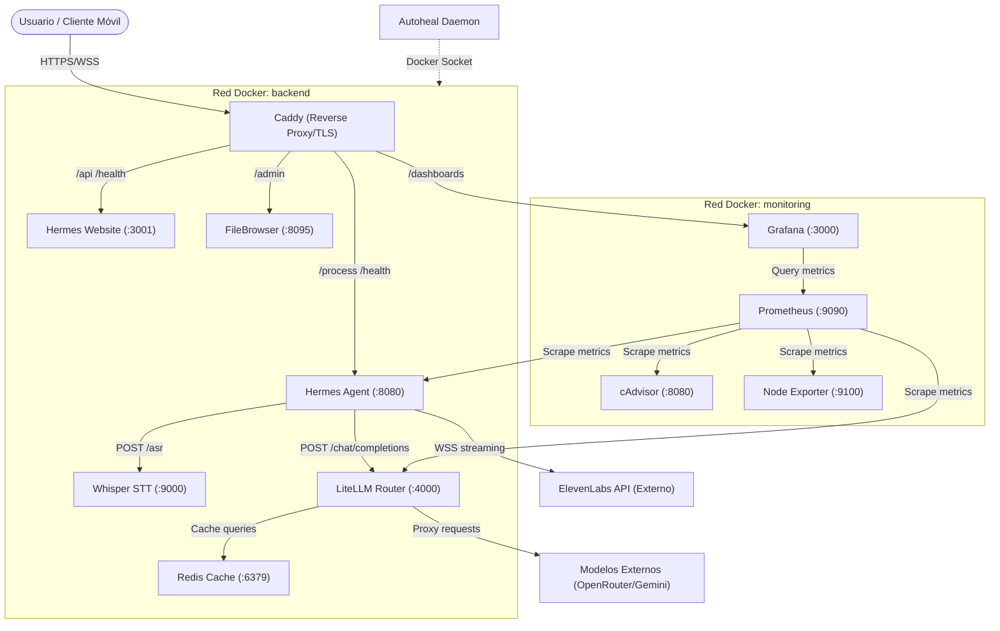
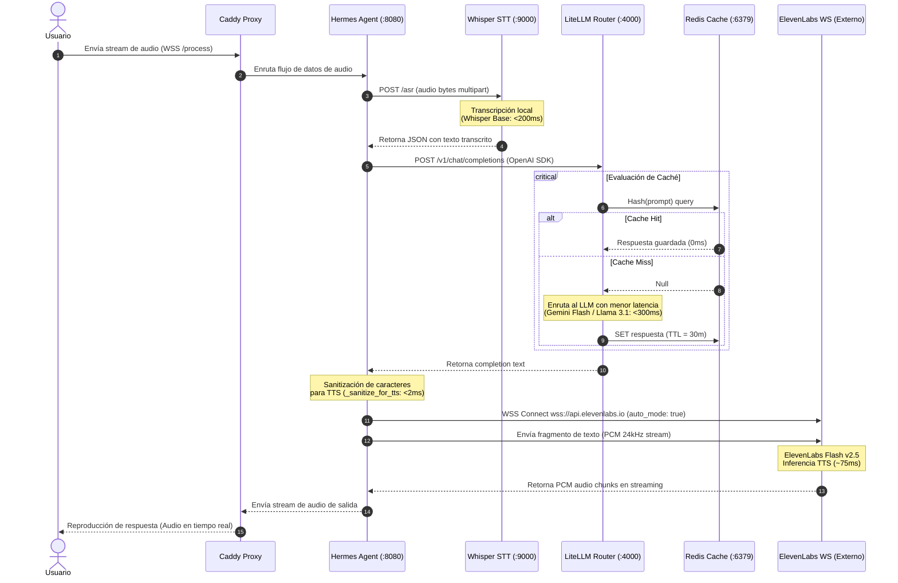
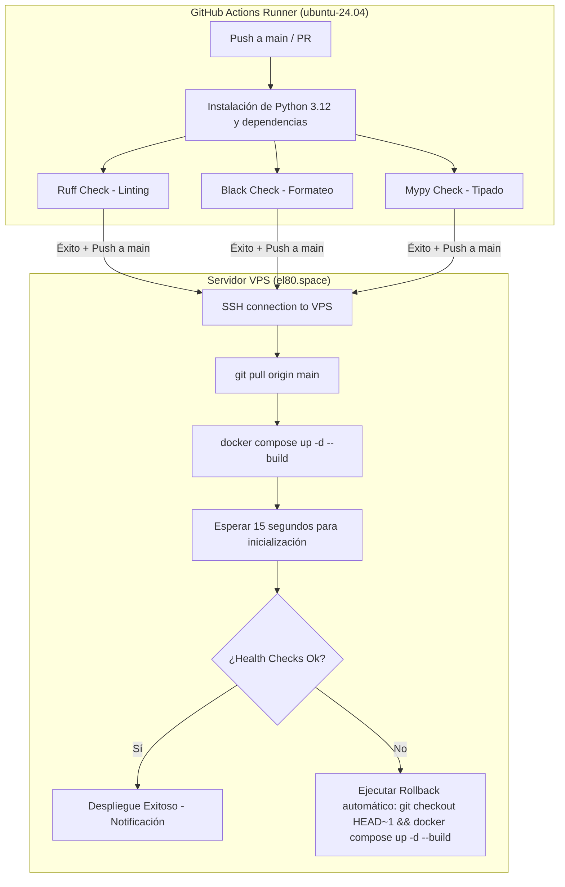

# Arquitectura del Sistema Hermes Stack: Documentación Técnica de Alta Fidelidad

Este documento proporciona una descripción técnica, exhaustiva y profesional de la arquitectura del **Hermes Stack**, una plataforma autohospedada de Inteligencia Artificial conversacional por voz y observabilidad integrada en un servidor privado virtual (VPS) bajo el dominio primario `el80.space`.

---

## 1. Topología del Sistema y Componentes de Software

El sistema está orquestado mediante [docker-compose.yml](file:///root/docker-compose.yml) y consta de 11 servicios principales que interactúan a través de redes Docker aisladas para separar el tráfico funcional del tráfico de observabilidad.



### 1.1 Características y Justificación de Componentes

| Componente | Imagen Base | Características Técnicas | Justificación del Rol y Parámetros |
| :--- | :--- | :--- | :--- |
| **Caddy** | Host / Nativo | Proxy inverso con soporte automático de HTTPS mediante ACME (Let's Encrypt). | Actúa como el único punto de entrada público cifrado del VPS. Aísla todos los contenedores del exterior a través de loopback (`127.0.0.1`). |
| **Hermes Agent** | Custom (`python:3.12-slim`) | Agente asíncrono desarrollado en Python/aiohttp. Orquestador central del flujo conversacional. | Implementa la sanitización de respuestas para TTS, gestión de sesión persistente con Redis y websocket streaming con ElevenLabs. |
| **Whisper STT** | `onerahmet/openai-whisper-asr-webservice:latest` | Servicio local de Speech-to-Text que expone la API de Whisper (modelo base). | Permite la transcripción local ultra rápida (<200ms) sin enviar el audio original del usuario a endpoints externos, optimizando latencia y privacidad. |
| **LiteLLM Router** | `ghcr.io/berriai/litellm:main-latest` | Router y proxy unificado de LLMs compatible con la API de OpenAI. | Abstrae los proveedores de modelos externos (OpenRouter y Gemini), centraliza las claves del sistema y ejecuta estrategias dinámicas de fallback y balanceo de carga. |
| **Redis Cache** | `redis:7-alpine` | Base de datos in-memory con soporte de expiración automática de llaves (TTL). | Caché del LiteLLM Router para evitar llamadas LLM redundantes en preguntas idénticas o repetidas, reduciendo costos de API y logrando latencias de 0ms en hit. |
| **Hermes Website** | Custom Next.js 14 | Aplicación web construida con React Server Components y App Router. | Proporciona el centro de documentación y el dashboard de control para monitorizar el estado de los servicios. |
| **Prometheus** | `prom/prometheus:v2.52.0` | Servidor de base de datos temporal (Time-Series) y evaluador de alertas. | Recolecta métricas cada 15 segundos y evalúa alertas críticas como saturación de CPU, fallos de contenedores y latencias elevadas. |
| **Grafana** | `grafana/grafana:11.0.0` | Suite de visualización de datos y dashboards analíticos. | Proporciona interfaces visuales amigables de observabilidad para evaluar el rendimiento del sistema y el histórico de uso. |
| **cAdvisor** | `gcr.io/cadvisor/cadvisor:v0.49.1` | Exporter de métricas de contenedores que lee directamente del runtime de cgroups del host. | Expone el uso de recursos a nivel de contenedor individual (CPU, memoria, red, disco) sin requerir agentes pesados. |
| **Node Exporter** | `prom/node-exporter:v1.8.1` | Exporter de métricas de hardware y del sistema operativo a nivel de Host. | Permite a Prometheus monitorizar la CPU del VPS, la memoria del sistema operativo, el espacio de almacenamiento físico y la carga de red global. |
| **Autoheal** | `willfarrell/autoheal:1.2.0` | Demonio ligero conectado al socket de Docker de solo lectura (`/var/run/docker.sock`). | Realiza reinicios en caliente (`docker restart`) automáticos e inmediatos para cualquier servicio cuyo health check de Docker transicione a estado `unhealthy`. |

---

## 2. Pipeline End-to-End de Voz e Inteligencia

El pipeline de voz extremo a extremo convierte la entrada del micrófono del usuario en una respuesta de audio sintetizada en tiempo real, operando bajo un estricto SLO (Service Level Objective) de **latencia inferior a 500 ms**.

### 2.1 Diagrama de Secuencia del Pipeline de Audio y Texto



### 2.2 Desglose de Latencias y Optimizaciones Aplicadas

El SLO de < 500ms se logra a través de optimizaciones específicas en cada etapa del pipeline:

1. **Captura y Transmisión de Audio (Cliente + Caddy) ~ 20ms**
   * **Optimización:** Uso de TLS 1.3 y enrutamiento HTTP/2 que elimina el overhead de establecimiento de conexión en peticiones subsiguientes.
2. **STT (Speech-to-Text - Whisper STT) < 200ms**
   * **Optimización:** Ejecución en local dentro de la red privada de Docker, evitando el tiempo de ida y vuelta a internet (reducción de un ~60% en la latencia de red en comparación con APIs externas).
3. **LiteLLM Router < 10ms**
   * **Optimización:** Configuración de `routing_strategy: latency-based-routing` y almacenamiento en caché de Redis para respuestas duplicadas.
4. **Inferencia LLM (Modelos de lenguaje) < 300ms (TTFB)**
   * **Optimización:** Preferencia por modelos del tier rápido (como `gemini-flash` y `gpt-4o-mini`).
5. **Sanitización de Texto para TTS (Hermes) < 2ms**
   * **Optimización:** Procesamiento síncrono en memoria de la cadena de texto, eliminando caracteres especiales e indicadores markdown para evitar que el sintetizador intente "pronunciarlos".
6. **TTS (Text-to-Speech - ElevenLabs Flash v2.5) ~ 75ms**
   * **Optimización:** El uso de `auto_mode: true` en la conexión WebSocket con ElevenLabs. Esto instruye al sintetizador a omitir buffers internos y programadores de fragmentos, procesando el texto de forma inmediata en cuanto detecta el final de una cláusula o frase. La desactivación de la compresión WebSocket (`compression=None`) elimina además la latencia de serialización en el enlace.

---

## 3. Estrategia de Robustez y Fallback de Modelos en LiteLLM

La configuración del router en [config/litellm.yaml](file:///root/config/litellm.yaml) maneja una política activa de tolerancia a fallos. Si un proveedor de API experimenta cortes de servicio, LiteLLM enruta las peticiones de forma transparente al modelo secundario configurado.

### 3.1 Jerarquía de Fallback Implementada

```
                 [ LiteLLM Router (:4000) ]
                            │
       ┌────────────────────┼────────────────────┐
       ▼ (1)                ▼ (2)                ▼ (3)
[ gemini-flash ]     [ llama-3-1-70b ]     [ gpt-4o-mini ]
(Vía Google API)     (Vía OpenRouter)      (Vía OpenRouter)
   RPM: 1000            RPM: 1000             RPM: 500
 Timeout: 10s         Timeout: 10s          Timeout: 15s
```

* **Métrica de corte:** Si un modelo acumula **2 fallos consecutivos**, LiteLLM lo retira temporalmente de la lista de enrutamiento durante un período de enfriamiento de **60 segundos** (`cooldown_time: 60`), derivando el tráfico al modelo de respaldo inmediato.

---

## 4. Pipeline de Despliegue CI/CD (GitHub Actions a VPS)

El ciclo de vida del desarrollo está automatizado mediante un pipeline de CI/CD que valida la integridad del código y realiza despliegues continuos sin tiempo de inactividad visible (zero-downtime deploy).



### 4.1 Script de Validación y Verificación Post-Deploy
Durante el paso 9 del pipeline del VPS, se ejecutan peticiones locales que determinan si la nueva imagen es saludable. El script realiza validaciones como:

```bash
# Health check de LiteLLM con API Key activa
(source .env && curl -f -H "Authorization: Bearer $LITELLM_MASTER_KEY" http://127.0.0.1:4000/health) || (
    echo 'LiteLLM no saludable! Deshaciendo cambios...'
    git checkout HEAD~1
    docker compose up -d --build
    exit 1
)

# Health check del Agente Hermes
curl -f http://127.0.0.1:8080/health || (
    echo 'Hermes Agent no saludable! Deshaciendo cambios...'
    git checkout HEAD~1
    docker compose up -d --build
    exit 1
)
```

---

## 5. Estrategia de Seguridad (Defense-in-Depth)

Para garantizar la seguridad de la infraestructura privada y proteger las API keys de terceros, el stack aplica múltiples capas de seguridad:

1. **Aislamiento de Puertos (Loopback binding):**
   Todos los puertos de contenedores en [docker-compose.yml](file:///root/docker-compose.yml) están expuestos explícitamente a `127.0.0.1` (ej. `127.0.0.1:8080:8080`). Esto evita que los servicios escuchen peticiones en la IP pública del host y los hace inaccesibles desde internet, a menos que sean ruteados deliberadamente por Caddy.
2. **Redes Aisladas:**
   * `backend`: Utilizada para el tráfico funcional. Los contenedores de base de datos (Redis) y modelos internos (Whisper) se encuentran aquí.
   * `monitoring`: Red dedicada a la recolección de métricas. Los exporters y servidores de Prometheus/Grafana recopilan la telemetría a través de esta red independiente.
3. **Privilegios Reducidos en Contenedores:**
   * Uso de directivas `security_opt: [no-new-privileges:true]` para prevenir la escalada de privilegios en el contenedor de LiteLLM y Hermes.
   * Eliminación de capacidades del kernel de Linux mediante `cap_drop: [ALL]` en el contenedor de Redis y Hermes.
   * Montaje de almacenamiento efímero en RAM mediante `tmpfs` para directorios temporales, configurado con las banderas `noexec, nosuid` para evitar la inyección y ejecución de binarios maliciosos.

---

## 6. Monitoreo, Alertas y Auto-Curación

La observabilidad es un pilar fundamental del Hermes Stack. Permite detectar de forma proactiva degradaciones de latencia y cortes de servicio.

### 6.1 Bucle de Recuperación Automática (Auto-Healing)
El daemon `autoheal` monitoriza de manera reactiva el estado de salud expuesto por los health checks internos de Docker:

```
[ Contenedor en ejecución ] ──► [ Health Check falla 3 veces ]
                                         │
                                         ▼
[ Autoheal intercepta evento ] ──► [ Ejecuta: docker restart <container> ]
                                         │
                                         ▼
[ Contenedor vuelve a estar Up ] ◄── [ Re-evaluación de salud ]
```

### 6.2 Watchdog a Nivel de Sistema (Host Daemon)
Un script tipo daemon ejecutado mediante Systemd (`docker-watchdog.sh`) supervisa el daemon general de Docker. Si el servicio principal de Docker se congela o deja de responder a peticiones del socket local:
1. El script detecta el fallo de sockets.
2. Envía de inmediato una alerta crítica a un Webhook de Slack.
3. Ejecuta de forma automática `systemctl restart docker` para restablecer el servicio a nivel de sistema operativo en menos de 60 segundos.
